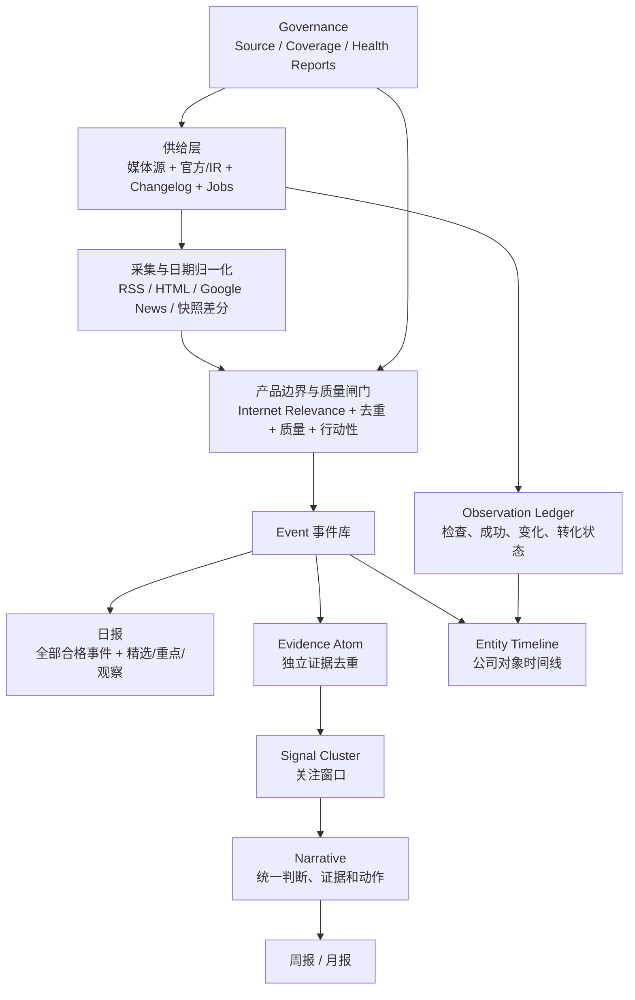

# 全球互联网情报站：整体设计与架构

> 更新基线：2026-07-15。本文是理解项目的第一入口；具体展示规则见 [VIEW_CONTRACT.md](VIEW_CONTRACT.md)，详细使用说明见 [USAGE_GUIDE.md](USAGE_GUIDE.md)。

## 1. 产品目标

面向出海 BD、战略、投资和产业研究人员，把分散的全球互联网动态整理成可跟进的对象、窗口和趋势。

系统不是新闻聚合器，也不替用户做最终决策。它负责：

```text
发现事实 -> 判断是否属于本站 -> 评估价值 -> 关联对象
-> 组织证据 -> 帮用户排序 -> 保留可审计依据
```

核心原则：**不隐藏合格事实，但帮助用户排序；不强行制造趋势，但保留形成趋势的证据。**

## 2. 四个产品视图

| 视图 | 回答的问题 | 产品职责 |
|---|---|---|
| 日报 | 今天发生了什么，先看什么？ | 展示全部合格事件，按“精选 / 重点 / 观察”排序 |
| 周报 | 本周形成了什么窗口？ | 聚合跨事件、跨对象的关注窗口和下周观察方向 |
| 月报 | 哪些趋势和结构正在变化？ | 观察跨周重复信号、区域/赛道升温和资源方向 |
| 公司索引 | 这个对象近期发生了什么？ | 展示对象事件时间线和观察点运行状态 |

一句话记忆：

```text
日报看事实和优先级
周报看窗口和方向
月报看趋势和结构
公司索引看对象和观察状态
```

## 3. 总体架构



日报直接消费合格事件，不依赖 Narrative 才能展示。Narrative 主要服务周报、月报和窗口解释。

## 4. 供给体系

### Source Registry

`Source` 是主抽象，不是 RSS。一个信源可以通过 RSS、HTML、API、Sitemap、Newsroom、IR、Changelog 或 Jobs 接入。

信源分层解决“可信度”：

| 层级 | 定位 |
|---|---|
| L1 | 官方、IR、Newsroom、Changelog |
| L2 | 垂直交易和融资媒体 |
| L3 | 区域互联网生态媒体 |
| L4 | 支付、电商、游戏、广告等精品垂类 |
| L5 | Google News 补漏，不承担主发现 |

### Entity Pool

对象池记录重点公司及其观察点，例如 Newsroom、IR、Jobs、Changelog、Developer Docs 和 Product Update。

当前 Jobs 试点：

- Grab、Stripe、Shopify 已接入快照差分。
- 单个职位不是事件；只有集中新增、集中撤下或职能结构变化才形成候选信号。
- MercadoLibre Eightfold、Careem 动态职位站仍待专用适配器。

## 5. 三道核心闸门

每条内容进入主展示前必须分别回答三个问题：

| 维度 | 问题 | 典型实现 |
|---|---|---|
| 互联网相关度 | 是否属于全球互联网产业？ | `internet_relevance.py` |
| 事件价值 | 是否重要、可信、可解释？ | `event_value.py` / `analysis_quality.py` |
| 行动性 | 是否影响预算、扩张、采购、合作或组织？ | BD priority / signal taxonomy |

融资不是默认高价值。只有属于互联网主赛道，并明确体现预算、扩张、采购、生态合作、区域进入或产品/API 动作时，才进入日报重点；其余融资最多作为观察或趋势温度信号。

## 6. 认知对象

```text
Event
  -> Evidence Atom
  -> Signal Cluster
  -> Narrative
  -> 周报窗口 / 月报趋势
```

- `Event`：可验证的单条事实。
- `Evidence Atom`：把同对象、同动作、同来源的相似报道压成独立证据。
- `Signal Cluster`：至少由多个独立证据支持的关注窗口。
- `Narrative`：统一主题、对象、判断、证据、建议动作和置信度。

证据不足时必须降级为事件或观察项，不能为了证明趋势而制造趋势。

## 7. 时间模型

日期字段必须分开：

- `published_at`：内容真实发布日期。
- `observed_at`：系统发现内容的时间。
- `scheduled_at`：未来生效或计划日期。
- `date`：兼容页面的展示桶，并通过 `date_basis` 标明依据。

另外还要区分：

- `workflow_run_time`：自动任务运行时间。
- `event_date`：事件归属日期。
- `display_main_date`：首页选择的成熟批次日期。

未来计划日期不得污染发布日期、健康报告和首页排序。

## 8. 公司观察账本

公司“没有优质事件”不能只有一个空状态。每个观察点需要区分：

| 状态 | 含义 |
|---|---|
| 近期有动作 | 已形成合格事件 |
| 已检查，暂无显著变化 | 采集成功，对象近期安静 |
| 有变化，未达情报门槛 | 页面发生变化，但未升格为事件 |
| 接入失效 | 最近采集或解析失败 |
| 部分覆盖 | 只有部分观察点具备可信运行证据 |
| 待接入 | 已登记但尚无采集器 |
| 状态待确认 | 旧运行记录不足以判断成功或失败 |

目标不是让每家公司每天都有新闻，而是让每家公司都有可信、可解释的观察状态。

## 9. 治理与健康检查

系统通过四类报告定位问题：

- Source Health：信源是稳定、部分有效、零命中还是失败。
- Source Conversion：`raw -> signal -> stored -> main/review` 卡在哪一层。
- Daily Coverage：事件数、对象数、区域数、赛道数是否健康。
- Entity Observation Ledger：对象和观察点是否真正被检查、是否发生变化、是否转成事件。

排查原则：先区分“没有内容、没有抓到、抓到但未入选”，再决定修信源、修解析器还是调整产品门槛。

## 10. 关键文件

| 文件 | 职责 |
|---|---|
| `scripts/fetch_news.py` | 采集、归一化、分析、入库和运行指标 |
| `data/source_registry.json` | 信源注册与属性 |
| `data/entity_pool.json` | 重点对象及观察点 |
| `data/events.json` | 90 天结构化事件库 |
| `scripts/internet_relevance.py` | 本站产品边界 |
| `scripts/event_value.py` | 事件价值、融资准入和展示资格 |
| `scripts/view_selectors.py` | 首页、RSS、公司、周期报告统一选择入口 |
| `scripts/evidence_atoms.py` | 独立证据归并 |
| `scripts/signal_clusters.py` | 关注窗口聚合 |
| `scripts/narratives.py` | 统一叙事层 |
| `scripts/entity_observation_ledger.py` | 公司与观察点运行账本 |
| `scripts/job_observation.py` | Jobs 快照、差分和职能聚类 |
| `scripts/generate_html.py` | 页面数据模型和静态页面生成 |
| `scripts/template.html` | 页面设计唯一真相来源 |
| `scripts/check_data_health.py` | 全链路健康检查 |

`docs/index.html` 和 `docs/feed.xml` 都是生成物，不应手工长期维护。

## 11. 当前边界与下一阶段

已经形成的底座：事件库、产品边界、统一选择器、证据/窗口/叙事层、信源转化治理、对象池、观察账本、三家公司 Jobs 试点。

下一阶段优先级：

1. 让自动运行持续积累观察账本和 Jobs 差分数据。
2. 为 Careem 和 MercadoLibre Jobs 增加动态站适配器。
3. 治理高 signal 低转化的官方源、Changelog 和垂类源。
4. 组织行为信号稳定后，再深化周报窗口和月报结构趋势。

暂不做：继续堆媒体源、把 Google News 当主发现、把单个职位当事件、在日报强行生成趋势、未经确认修改 workflow。
